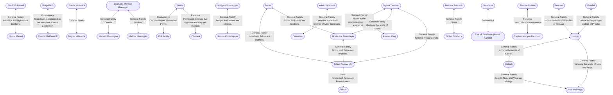

```mermaid
flowchart TD
Topic_3981(["Hykos Minsal"]); class Topic_3981 internal-link
Topic_3996(["Perrin"]); class Topic_3996 internal-link
Topic_4724(["Nathan Strebeck"]); class Topic_4724 internal-link
Topic_3944(["Nua and Veya"]); class Topic_3944 internal-link
Topic_3226(["Melkior Maeorgan"]); class Topic_3226 internal-link
Topic_2564(["Vianna Geldenhoff"]); class Topic_2564 internal-link
Topic_4812(["Naylor Whitelick"]); class Topic_4812 internal-link
Topic_2555(["Ansgar Flintknapper"]); class Topic_2555 internal-link
Topic_3978(["Navid"]); class Topic_3978 internal-link
Topic_3946(["Serefaros"]); class Topic_3946 internal-link
Topic_3943(["Kalesh"]); class Topic_3943 internal-link
Topic_3999(["Chelsea"]); class Topic_3999 internal-link
Topic_3990(["Gorim the Boarslayer"]); class Topic_3990 internal-link
Topic_3994(["Altair Simmons"]); class Topic_3994 internal-link
Topic_3179(["Shantar Froese"]); class Topic_3179 internal-link
Topic_3194(["Mendor Maeorgan"]); class Topic_3194 internal-link
Topic_2560(["Jorunn Flintknapper"]); class Topic_2560 internal-link
Topic_3966(["Nyssa Tasstani"]); class Topic_3966 internal-link
Topic_2556(["Bragollach"]); class Topic_2556 internal-link
Topic_4000(["Crimmins"]); class Topic_4000 internal-link
Topic_4002(["Old Smitty"]); class Topic_4002 internal-link
Topic_3942(["Hahnu"]); class Topic_3942 internal-link
Topic_3263(["Sheila Whitelick"]); class Topic_3263 internal-link
Topic_3977(["Kraken King"]); class Topic_3977 internal-link
Topic_4725(["Ethlyn Strebeck"]); class Topic_4725 internal-link
Topic_4016(["Eye of Serefaros (Isle of Kandril)"]); class Topic_4016 internal-link
Topic_4003(["Felicia"]); class Topic_4003 internal-link
Topic_3979(["Fendrick Minsal"]); class Topic_3979 internal-link
Topic_3250(["Captain Morgan Baumann"]); class Topic_3250 internal-link
Topic_3940(["Yenuan"]); class Topic_3940 internal-link
Topic_3193(["Sea Lord Marilise Maeorgan"]); class Topic_3193 internal-link
Topic_4001(["Talinn Runewright"]); class Topic_4001 internal-link
Topic_3938(["Prealat"]); class Topic_3938 internal-link
Topic_3940-- "General Family
Hahnu is the brother-in-law of Yenuan." <-->Topic_3942
Topic_3966-- "General Family
Nyssa is the granddaughter of the Kraken King." <-->Topic_3977
Topic_3996-- "Equivalence
Old Smittly has possessed Perrin." <-->Topic_4002
Topic_4724-- "General Family
Sister" <-->Topic_4725
Topic_3942-- "General Family
Hahnu is the uncle of Kalesh." <-->Topic_3943
Topic_3946-- "Equivalence" <-->Topic_4016
Topic_3179-- "Personal
Lover, friend & compantion" <-->Topic_3250
Topic_3979-- "General Family
Fendrick and Hykos are brothers." <-->Topic_3981
Topic_3193-- "General Family
Cousin" <-->Topic_3194
Topic_2555-- "General Family
Ansgar and Jorunn are siblings." <-->Topic_2560
Topic_3994-- "General Family
Crimmins is the half-brother of Altair Simmons." <-->Topic_4000
Topic_3938-- "General Family
Hahnu is the younger brother of Prealat." <-->Topic_3942
Topic_3996-- "Personal
Perrin and Chelsea live together and may get married." <-->Topic_3999
Topic_3990-- "General Family
Gorim and Talinn are brothers." <-->Topic_4001
Topic_3942-- "General Family
Hahnu is the uncle of Nua and Veya." <-->Topic_3944
Topic_2556-- "Equivalence
Bragollach is disguised as the merchant Vianna Geldenhoff." <-->Topic_2564
Topic_3978-- "General Family
Navid and Talinn are brothers." <-->Topic_4001
Topic_3943-- "General Family
Kalesh, Nua, and Veya are siblings." <-->Topic_3944
Topic_3263-- "General Family" <-->Topic_4812
Topic_4001-- "Peer
Felicia and Talinn are former lovers." <-->Topic_4003
Topic_3193-- "General Family
Brother" <-->Topic_3226
Topic_3966-- "General Family
Gorim is the uncle of Nyssa." <-->Topic_3990
Topic_3978-- "General Family
Gorim and Navid are brothers." <-->Topic_3990
Topic_3966-- "General Family
Talinn is Nyssa's uncle." <-->Topic_4001
```
