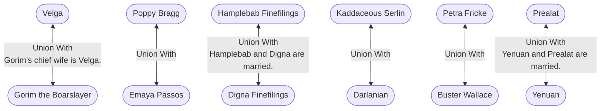

```mermaid
flowchart TD
Topic_3983(["Velga"]); class Topic_3983 internal-link
Topic_3965(["Digna Finefilings"]); class Topic_3965 internal-link
Topic_3232(["Poppy Bragg"]); class Topic_3232 internal-link
Topic_3990(["Gorim the Boarslayer"]); class Topic_3990 internal-link
Topic_3964(["Hamplebab Finefilings"]); class Topic_3964 internal-link
Topic_3233(["Emaya Passos"]); class Topic_3233 internal-link
Topic_4792(["Kaddaceous Serlin"]); class Topic_4792 internal-link
Topic_4815(["Buster Wallace"]); class Topic_4815 internal-link
Topic_4814(["Petra Fricke"]); class Topic_4814 internal-link
Topic_3938(["Prealat"]); class Topic_3938 internal-link
Topic_3940(["Yenuan"]); class Topic_3940 internal-link
Topic_4793(["Darlanian"]); class Topic_4793 internal-link
Topic_4814-- "Union With" <-->Topic_4815
Topic_3938-- "Union With
Yenuan and Prealat are married." <-->Topic_3940
Topic_3983-- "Union With
Gorim's chief wife is Velga." <-->Topic_3990
Topic_4792-- "Union With" <-->Topic_4793
Topic_3964-- "Union With
Hamplebab and Digna are married." <-->Topic_3965
Topic_3232-- "Union With" <-->Topic_3233
```
