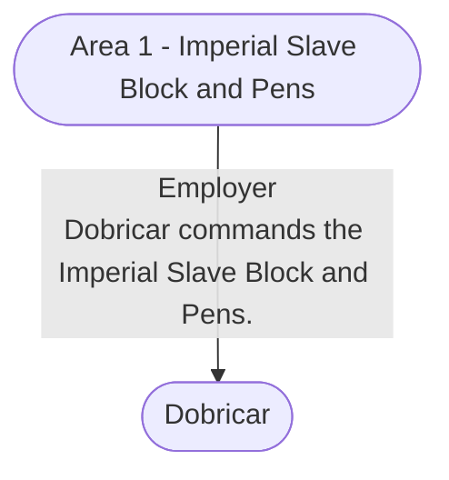

# Area 1 - Imperial Slave Block and Pens
## Overview
---
## Connections

```mermaid
flowchart TD
Topic_6367(["Area 1 - Imperial Slave Block and Pens"]); class Topic_6367 internal-link
Topic_6340(["Dobricar"]); class Topic_6340 internal-link
Topic_6367-- "Employer
Dobricar commands the Imperial Slave Block and Pens." -->Topic_6340
```
%%
links: [ [[ Dobricar]] ]
%%

---
## Tags
#Setting-Scope/Streets-of-Zobeck

