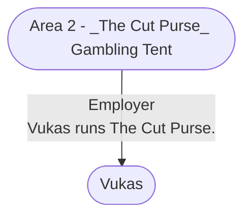

# Area 2 - "The Cut Purse" Gambling Tent
## Goods and Services
---
## Connections

```mermaid
flowchart TD
Topic_6364(["Area 2 - _The Cut Purse_ Gambling Tent"]); class Topic_6364 internal-link
Topic_6342(["Vukas"]); class Topic_6342 internal-link
Topic_6364-- "Employer
Vukas runs The Cut Purse." -->Topic_6342
```
%%
links: [ [[ Vukas]] ]
%%

---
## Tags
#Setting-Scope/Streets-of-Zobeck

