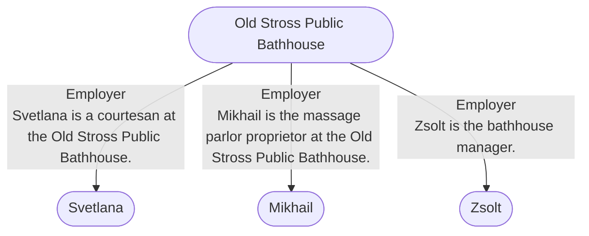

# Old Stross Public Bathhouse
## Overview
---
## Governed Content
- [[1 - Street Level]]
- [[2 - Underground Level]]
- [[Mikhail]]
- [[Svetlana]]
- [[Zsolt]]

---
## Connections

%%
links: [ [[ Svetlana]], [[ Mikhail]], [[ Zsolt]] ]
%%

---
## Tags
#Story-Scope/Everyone-Lies #Story-Scope/Rebuilding-a-Good-Man

