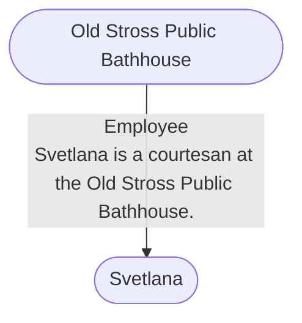

# Svetlana
## Overview
---
## Connections

```mermaid
flowchart TD
Topic_6272(["Svetlana"]); class Topic_6272 internal-link
Topic_6270(["Old Stross Public Bathhouse"]); class Topic_6270 internal-link
Topic_6270-- "Employee
Svetlana is a courtesan at the Old Stross Public Bathhouse." -->Topic_6272
```
%%
links: [ [[ Old Stross Public Bathhouse]] ]
%%

---
## Tags
#Story-Scope/Everyone-Lies #Story-Scope/Rebuilding-a-Good-Man

