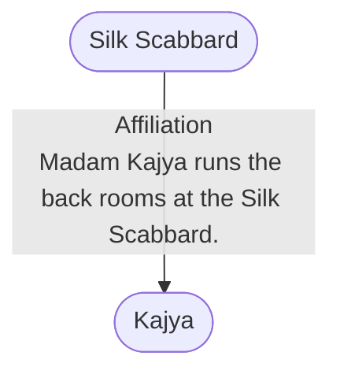

# Silk Scabbard
## Overview
---
## Governed Content
- [[1 - Street Level]]
- [[2 - Upper Level]]
- [[Atsen]]
- [[Drajan]]
- [[Jitka]]
- [[Kajya]]
- [[Timolius Druzeldorg]]
- [[Vandessian Thrikk]]

---
## Connections

%%
links: [ [[ Kajya]] ]
%%

---
## Tags
#Story-Scope/Everyone-Lies #Story-Scope/The-Fish-and-the-Rose #Story-Scope/Rebuilding-a-Good-Man #Story-Scope/Ripper

