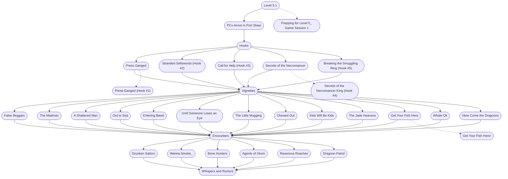

# 1 - Prepping Level 5.1
This is the general storyboard you should follow for this part of the adventure.

%%links: [ [[Bone Hunters]], [[False Beggars]], [[The Madman]], [[Breaking the Smuggling Ring (Hook #5)]], [[Press-Ganged (Hook #1)]], [[Dragoon Patrol]], [[The Little Mugging]], [[Secrets of the Necromancer King (Hook #4)]], [[Here Come the Dragoons]], [[Prepping for Level 5_ Game Session 1]], [[Chewed Out]], [[Drunken Sailors]], [[Call for Help (Hook #3)]], [[Out to Sea]], [[Agents of Skum]], [[Wanna Smoke_]], [[Get Your Fish Here!]], [[Entering Bawd]], [[A Shattered Man]], [[Ravenous Roaches]], [[Until Someone Loses an Eye]], [[Stranded Sellswords (Hook #2)]], [[Kids Will Be Kids]], [[Whale Oil]], [[The Jade Heavens]] ]
