# 2 - Prepping Level 5.2
This is the general storyboard you should follow for this part of the adventure.

```mermaid
flowchart TD
Node_1a(["Prepping for Level 5_ Game Session 2"]); class Node_1a internal-link
Node_1(["Level 5.2"])
Node_2(["Inciting Incidents"])
Node_3(["Adventure Options"])
Node_4a(["An argument about the Black Shark allows the PCs to befriend Old Craw"]); class Node_4a internal-link
Node_4(["1 - Argument"])
Node_5a(["Intervene as Dragoons threaten to beat an old Tulita man to death for his _crazy_ behavior"]); class Node_5a internal-link
Node_5(["2 - Intervention"])
Node_6a(["The infamous pirate Drango escapes, and the PCs help or hinder pursuit"]); class Node_6a internal-link
Node_6(["3 - Escape"])
Node_7a(["Under pressure from the PCs, a team of dragonsmoke pushers foolishly reveals their supplier"]); class Node_7a internal-link
Node_7(["4 - Under Pressure"])
Node_8a(["In a mad brawl between Tulita and new-comer dockworkers, who will the PCs back_"]); class Node_8a internal-link
Node_8(["5 - Mad Brawl"])
Node_9a(["A fire on the docks introduces a Wave Rider and grants the chance to be local heroes"]); class Node_9a internal-link
Node_9(["6 - Fire"])
Node_10a(["A pickpocket attempt by a former Wave Rider embroils the PCs in the Kraken's plots"]); class Node_10a internal-link
Node_10(["7 - Pickpocket"])
Node_11a(["A chance meeting introduces Bethany Razor, opening opportunities for adventure"]); class Node_11a internal-link
Node_11(["8 - Chance Meeting"])
Node_12a(["Discover a secret entrance into Fort Stormshield in the sewers"]); class Node_12a internal-link
Node_12(["1 - Secret Entrance"])
Node_13a(["Tangle with the Dragoons as they leave the sewers"]); class Node_13a internal-link
Node_13(["2 - Dragoons"])
Node_14a(["Fight or Join Port Shaw's Criminal Underworld"]); class Node_14a internal-link
Node_14(["3 - Criminal Underworld"])
Node_15a(["Rescue a child stolen by the Roachlord"]); class Node_15a internal-link
Node_15(["4 - Rescue a Child"])
Node_16a(["Lay a pirate bard's spirit to rest and find a treasure map in the sewers"]); class Node_16a internal-link
Node_16(["5 - Pirate Spirit"])
Node_17a(["Root out a nest of the Kraken's spies in the sewers"]); class Node_17a internal-link
Node_17(["6 - Kraken Spies"])
Node_18a(["Brawl bare knuckle for fame and profit in Port Shaw"]); class Node_18a internal-link
Node_18(["7 - Brawl Bare Knuckle"])
Node_19a(["Investigate an abandoned village plagued by shark attacks"]); class Node_19a internal-link
Node_19(["8 - Abandoned Village"])
Node_20a(["Redeem an Elf noble by rescuing her ship-mates from an Abyss-haunted isle"]); class Node_20a internal-link
Node_20(["9 - Redemption"])
Node_21a(["Lured inside an underwater mountain, the PCs fight extradimensional invaders"]); class Node_21a internal-link
Node_21(["10 - Lured"])
Node_22a(["Fight monsters on the high seas"]); class Node_22a internal-link
Node_22(["11 - Monsters"])
Node_23(["Remove Unused Adventure Options"])
Node_24(["Whispers and Rumors"])
Node_25(["Pick and Order Likely Inciting Incidents"])
Node_1 --> Node_23
Node_1 -.-> Node_1a
Node_2 --> Node_4
Node_2 --> Node_5
Node_2 --> Node_6
Node_2 --> Node_7
Node_2 --> Node_8
Node_2 --> Node_9
Node_2 --> Node_10
Node_2 --> Node_11
Node_3 --> Node_12
Node_3 --> Node_13
Node_3 --> Node_14
Node_3 --> Node_15
Node_3 --> Node_16
Node_3 --> Node_17
Node_3 --> Node_18
Node_3 --> Node_19
Node_3 --> Node_20
Node_3 --> Node_21
Node_3 --> Node_22
Node_4 --> Node_3
Node_4 -.-> Node_4a
Node_5 --> Node_3
Node_5 -.-> Node_5a
Node_6 --> Node_3
Node_6 -.-> Node_6a
Node_7 --> Node_3
Node_7 -.-> Node_7a
Node_8 --> Node_3
Node_8 -.-> Node_8a
Node_9 --> Node_3
Node_9 -.-> Node_9a
Node_10 --> Node_3
Node_10 -.-> Node_10a
Node_11 -.-> Node_11a
Node_12 --> Node_24
Node_12 -.-> Node_12a
Node_13 --> Node_24
Node_13 -.-> Node_13a
Node_14 --> Node_24
Node_14 -.-> Node_14a
Node_15 --> Node_24
Node_15 -.-> Node_15a
Node_16 --> Node_24
Node_16 -.-> Node_16a
Node_17 --> Node_24
Node_17 -.-> Node_17a
Node_18 --> Node_24
Node_18 -.-> Node_18a
Node_19 --> Node_24
Node_19 -.-> Node_19a
Node_20 --> Node_24
Node_20 -.-> Node_20a
Node_21 --> Node_24
Node_21 -.-> Node_21a
Node_22 --> Node_24
Node_22 -.-> Node_22a
Node_23 --> Node_25
Node_25 --> Node_2
```

%%links: [ [[Fight monsters on the high seas]], [[Lured inside an underwater mountain, the PCs fight extradimensional invaders]], [[Redeem an Elf noble by rescuing her ship-mates from an Abyss-haunted isle]], [[In a mad brawl between Tulita and new-comer dockworkers, who will the PCs back_]], [[Intervene as Dragoons threaten to beat an old Tulita man to death for his _crazy_ behavior]], [[A pickpocket attempt by a former Wave Rider embroils the PCs in the Kraken's plots]], [[An argument about the Black Shark allows the PCs to befriend Old Craw]], [[Lay a pirate bard's spirit to rest and find a treasure map in the sewers]], [[Fight or Join Port Shaw's Criminal Underworld]], [[Tangle with the Dragoons as they leave the sewers]], [[A fire on the docks introduces a Wave Rider and grants the chance to be local heroes]], [[Brawl bare knuckle for fame and profit in Port Shaw]], [[A chance meeting introduces Bethany Razor, opening opportunities for adventure]], [[Rescue a child stolen by the Roachlord]], [[Investigate an abandoned village plagued by shark attacks]], [[Prepping for Level 5_ Game Session 2]], [[The infamous pirate Drango escapes, and the PCs help or hinder pursuit]], [[Discover a secret entrance into Fort Stormshield in the sewers]], [[Root out a nest of the Kraken's spies in the sewers]], [[Under pressure from the PCs, a team of dragonsmoke pushers foolishly reveals their supplier]] ]
