# 3 - Prepping Level 6-7
This is the general storyboard you should follow for this part of the adventure.

```mermaid
flowchart TD
Node_1a(["Prepping for Level 6-7"]); class Node_1a internal-link
Node_1(["Level 6-7"])
Node_2(["Remove Used Adventure Options"])
Node_3(["Advenure Options"])
Node_4(["Whispers and Rumors"])
Node_5a(["Discover a secret entrance into Fort Stormshield in the sewers"]); class Node_5a internal-link
Node_5(["1 - Secret Entrance"])
Node_6a(["Tangle with the Dragoons as they leave the sewers"]); class Node_6a internal-link
Node_6(["2 - Dragoons"])
Node_7a(["Fight or Join Port Shaw's Criminal Underworld"]); class Node_7a internal-link
Node_7(["3 - Criminal Underworld"])
Node_8a(["Rescue a child stolen by the Roachlord"]); class Node_8a internal-link
Node_8(["4 - Rescue a Child"])
Node_9a(["Recover an elven diplomat's stolen magic ring from the sewers"]); class Node_9a internal-link
Node_9(["5 - Stolen Ring"])
Node_10a(["Lay a pirate bard's spirit to rest and find a treasure map in the sewers"]); class Node_10a internal-link
Node_10(["6 - Pirate Spirit"])
Node_11a(["Put down a criminal gang extorting Tulita in the outskirts"]); class Node_11a internal-link
Node_11(["7 - Extortion"])
Node_12a(["Root out a nest of the Kraken's spies in the sewers"]); class Node_12a internal-link
Node_12(["8 - Kraken Spies"])
Node_13a(["Brawl bare knuckle for fame and profit in Port Shaw"]); class Node_13a internal-link
Node_13(["9 - Brawl Bare Knuckle"])
Node_14a(["Brave Blacksink Marsh to save kidnapped plantation workers from sacrifice"]); class Node_14a internal-link
Node_14(["10 - Kidnapped Plantation Workers"])
Node_15a(["Explore a shrine to the shark god, revealed by an earthquake"]); class Node_15a internal-link
Node_15(["11 - Shrine to the Shark God"])
Node_16a(["Wipe out a ring of humanoid trafficking drug smugglers"]); class Node_16a internal-link
Node_16(["12 - Humanoid Trafficking"])
Node_17a(["Fight monsters on the high seas"]); class Node_17a internal-link
Node_17(["13 - Monsters"])
Node_1 --> Node_2
Node_1 -.-> Node_1a
Node_2 --> Node_3
Node_3 --> Node_5
Node_3 --> Node_6
Node_3 --> Node_7
Node_3 --> Node_8
Node_3 --> Node_9
Node_3 --> Node_10
Node_3 --> Node_11
Node_3 --> Node_12
Node_3 --> Node_13
Node_3 --> Node_14
Node_3 --> Node_15
Node_3 --> Node_16
Node_3 --> Node_17
Node_5 --> Node_4
Node_5 -.-> Node_5a
Node_6 --> Node_4
Node_6 -.-> Node_6a
Node_7 --> Node_4
Node_7 -.-> Node_7a
Node_8 --> Node_4
Node_8 -.-> Node_8a
Node_9 --> Node_4
Node_9 -.-> Node_9a
Node_10 --> Node_4
Node_10 -.-> Node_10a
Node_11 --> Node_4
Node_11 -.-> Node_11a
Node_12 --> Node_4
Node_12 -.-> Node_12a
Node_13 --> Node_4
Node_13 -.-> Node_13a
Node_14 --> Node_4
Node_14 -.-> Node_14a
Node_15 --> Node_4
Node_15 -.-> Node_15a
Node_16 --> Node_4
Node_16 -.-> Node_16a
Node_17 --> Node_4
Node_17 -.-> Node_17a
```

%%links: [ [[Rescue a child stolen by the Roachlord]], [[Fight or Join Port Shaw's Criminal Underworld]], [[Recover an elven diplomat's stolen magic ring from the sewers]], [[Brawl bare knuckle for fame and profit in Port Shaw]], [[Put down a criminal gang extorting Tulita in the outskirts]], [[Tangle with the Dragoons as they leave the sewers]], [[Lay a pirate bard's spirit to rest and find a treasure map in the sewers]], [[Wipe out a ring of humanoid trafficking drug smugglers]], [[Brave Blacksink Marsh to save kidnapped plantation workers from sacrifice]], [[Discover a secret entrance into Fort Stormshield in the sewers]], [[Explore a shrine to the shark god, revealed by an earthquake]], [[Fight monsters on the high seas]], [[Prepping for Level 6-7]], [[Root out a nest of the Kraken's spies in the sewers]] ]
