# 5 - Prepping Level 8-9
This is the general storyboard you should follow for this part of the adventure.

```mermaid
flowchart TD
Node_1a(["Prepping for Level 8-9"]); class Node_1a internal-link
Node_1(["Level 8-9"])
Node_2(["Remove Unused Adventure Options"])
Node_3(["Adventure Options"])
Node_4a(["Recover an elven diplomat's stolen magic ring from the sewers"]); class Node_4a internal-link
Node_4(["1 - Stolen Ring"])
Node_5(["Whispers and Rumors"])
Node_6a(["Lay a pirate bard's spirit to rest and find a treasure map in the sewers"]); class Node_6a internal-link
Node_6(["2 - Pirate Spirit"])
Node_7a(["Put down a criminal gang extorting Tulita in the outskirts"]); class Node_7a internal-link
Node_7(["3 - Extortion"])
Node_8a(["Brawl bare knuckle for fame and profit in Port Shaw"]); class Node_8a internal-link
Node_8(["4 - Brawl Bare Knuckle"])
Node_9a(["Hunt the lost treasures of an ancient necromancer in the sewers"]); class Node_9a internal-link
Node_9(["5 - Hunt for Lost Treasure"])
Node_10a(["Uncover a demonic plot to detonate Quell's chapterhouse in Port Shaw"]); class Node_10a internal-link
Node_10(["6 - Demonic Plot"])
Node_11a(["Battle a sewage elemental beneath Port Shaw"]); class Node_11a internal-link
Node_11(["7 - Battle Elemental"])
Node_12a(["Wipe out a ring of humanoid trafficking drug smugglers"]); class Node_12a internal-link
Node_12(["8 - Humanoid Trafficking"])
Node_13a(["Fight monsters on the high seas"]); class Node_13a internal-link
Node_13(["9 - Monsters"])
Node_14a(["Investigate why the lighthouse on Beacon Island went dark"]); class Node_14a internal-link
Node_14(["10 - Lighthouse"])
Node_15a(["Stop an assassination attempt on Zalen Trafalgar"]); class Node_15a internal-link
Node_15(["11 - Assassination Attempt"])
Node_16a(["Foil the Kraken's plot to marry a double agent to the locathah king"]); class Node_16a internal-link
Node_16(["12 - Foil Plot"])
Node_17a(["Hunt for underwater treasures and discover the wreck of the Razor's Edge"]); class Node_17a internal-link
Node_17(["13 - Hunt for Underwater Treasures"])
Node_18a(["Scout the home base of the Krakenfiend and hope to escape alive"]); class Node_18a internal-link
Node_18(["14 - Scout Home Base"])
Node_19a(["Bargain with a Loa and travel the elemental realms on a mission for a demi-deity"]); class Node_19a internal-link
Node_19(["15 - Bargain with Loa"])
Node_1 --> Node_2
Node_1 -.-> Node_1a
Node_2 --> Node_3
Node_3 --> Node_4
Node_3 --> Node_6
Node_3 --> Node_7
Node_3 --> Node_8
Node_3 --> Node_9
Node_3 --> Node_10
Node_3 --> Node_11
Node_3 --> Node_12
Node_3 --> Node_13
Node_3 --> Node_14
Node_3 --> Node_15
Node_3 --> Node_16
Node_3 --> Node_17
Node_3 --> Node_18
Node_3 --> Node_19
Node_4 --> Node_5
Node_4 -.-> Node_4a
Node_6 --> Node_5
Node_6 -.-> Node_6a
Node_7 --> Node_5
Node_7 -.-> Node_7a
Node_8 --> Node_5
Node_8 -.-> Node_8a
Node_9 --> Node_5
Node_9 -.-> Node_9a
Node_10 --> Node_5
Node_10 -.-> Node_10a
Node_11 --> Node_5
Node_11 -.-> Node_11a
Node_12 --> Node_5
Node_12 -.-> Node_12a
Node_13 --> Node_5
Node_13 -.-> Node_13a
Node_14 --> Node_5
Node_14 -.-> Node_14a
Node_15 --> Node_5
Node_15 -.-> Node_15a
Node_16 --> Node_5
Node_16 -.-> Node_16a
Node_17 --> Node_5
Node_17 -.-> Node_17a
Node_18 --> Node_5
Node_18 -.-> Node_18a
Node_19 --> Node_5
Node_19 -.-> Node_19a
```

%%links: [ [[Bargain with a Loa and travel the elemental realms on a mission for a demi-deity]], [[Prepping for Level 8-9]], [[Recover an elven diplomat's stolen magic ring from the sewers]], [[Brawl bare knuckle for fame and profit in Port Shaw]], [[Put down a criminal gang extorting Tulita in the outskirts]], [[Uncover a demonic plot to detonate Quell's chapterhouse in Port Shaw]], [[Lay a pirate bard's spirit to rest and find a treasure map in the sewers]], [[Scout the home base of the Krakenfiend and hope to escape alive]], [[Hunt the lost treasures of an ancient necromancer in the sewers]], [[Wipe out a ring of humanoid trafficking drug smugglers]], [[Stop an assassination attempt on Zalen Trafalgar]], [[Investigate why the lighthouse on Beacon Island went dark]], [[Battle a sewage elemental beneath Port Shaw]], [[Hunt for underwater treasures and discover the wreck of the Razor's Edge]], [[Fight monsters on the high seas]], [[Foil the Kraken's plot to marry a double agent to the locathah king]] ]
