# 6 - Prepping Level 9-10
This is the general storyboard you should follow for this part of the adventure.

```mermaid
flowchart TD
Node_1a(["Prepping for Level 9-10"]); class Node_1a internal-link
Node_1(["Level 9-10"])
Node_2(["Remove Unused Adventure Options"])
Node_3(["Blow Up Quell's Chapterhouse"])
Node_4(["Adventure Options"])
Node_5a(["Put down a criminal gang extorting Tulita in the outskirts"]); class Node_5a internal-link
Node_5(["1 - Extortion"])
Node_6(["Whispers and Rumors"])
Node_7a(["Brawl bare knuckle for fame and profit in Port Shaw"]); class Node_7a internal-link
Node_7(["2 - Brawl Bare Knuckle"])
Node_8a(["Battle a sewage elemental beneath Port Shaw"]); class Node_8a internal-link
Node_8(["3 - Battle Elemental"])
Node_9a(["Fight monsters on the high seas"]); class Node_9a internal-link
Node_9(["4 - Monsters"])
Node_10a(["Stop an assassination attempt on Zalen Trafalgar"]); class Node_10a internal-link
Node_10(["5 - Assassination Attempt"])
Node_11a(["An ambush by weresharks posing as refugees reveals important clues"]); class Node_11a internal-link
Node_11(["6 - Ambushed"])
Node_12a(["Foil the Kraken's plot to marry a double agent to the locathah king"]); class Node_12a internal-link
Node_12(["7 - Foil Plot"])
Node_13a(["Hunt for underwater treasures and discover the wreck of the Razor's Edge"]); class Node_13a internal-link
Node_13(["8 - Hunt for Underwater Treasures"])
Node_14a(["Confront the Chosen of Dajobas in his secret, underwater caves"]); class Node_14a internal-link
Node_14(["9 - Confront the Chosen One"])
Node_15a(["Scout the home base of the Krakenfiend and hope to escape alive"]); class Node_15a internal-link
Node_15(["10 - Scout Home Base"])
Node_16a(["Brave mad admirals, forbidden islands and treachery to loot a city of gold"]); class Node_16a internal-link
Node_16(["11 - City of Gold"])
Node_17a(["Bargain with a Loa and travel the elemental realms on a mission for a demi-deity"]); class Node_17a internal-link
Node_17(["12 - Bargain with Loa"])
Node_1 --> Node_3
Node_1 -.-> Node_1a
Node_2 --> Node_4
Node_3 --> Node_2
Node_4 --> Node_5
Node_4 --> Node_7
Node_4 --> Node_8
Node_4 --> Node_9
Node_4 --> Node_10
Node_4 --> Node_11
Node_4 --> Node_12
Node_4 --> Node_13
Node_4 --> Node_14
Node_4 --> Node_15
Node_4 --> Node_16
Node_4 --> Node_17
Node_5 --> Node_6
Node_5 -.-> Node_5a
Node_7 --> Node_6
Node_7 -.-> Node_7a
Node_8 --> Node_6
Node_8 -.-> Node_8a
Node_9 --> Node_6
Node_9 -.-> Node_9a
Node_10 --> Node_6
Node_10 -.-> Node_10a
Node_11 --> Node_6
Node_11 -.-> Node_11a
Node_12 --> Node_6
Node_12 -.-> Node_12a
Node_13 --> Node_6
Node_13 -.-> Node_13a
Node_14 --> Node_6
Node_14 -.-> Node_14a
Node_15 --> Node_6
Node_15 -.-> Node_15a
Node_16 --> Node_6
Node_16 -.-> Node_16a
Node_17 --> Node_6
Node_17 -.-> Node_17a
```

%%links: [ [[Bargain with a Loa and travel the elemental realms on a mission for a demi-deity]], [[Brawl bare knuckle for fame and profit in Port Shaw]], [[Put down a criminal gang extorting Tulita in the outskirts]], [[Scout the home base of the Krakenfiend and hope to escape alive]], [[Stop an assassination attempt on Zalen Trafalgar]], [[Brave mad admirals, forbidden islands and treachery to loot a city of gold]], [[Confront the Chosen of Dajobas in his secret, underwater caves]], [[Battle a sewage elemental beneath Port Shaw]], [[An ambush by weresharks posing as refugees reveals important clues]], [[Hunt for underwater treasures and discover the wreck of the Razor's Edge]], [[Fight monsters on the high seas]], [[Foil the Kraken's plot to marry a double agent to the locathah king]], [[Prepping for Level 9-10]] ]
