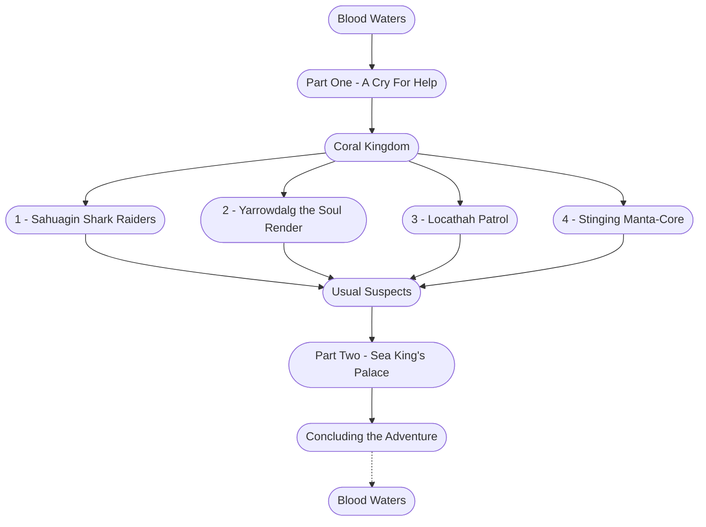

# Blood Waters (Storyboard)

%%links: [ [[4 - Stinging Manta-Core]], [[1 - Sahuagin Shark Raiders]], [[3 - Locathah Patrol]], [[Usual Suspects]], [[Part One - A Cry For Help]], [[Coral Kingdom]], [[2 - Yarrowdalg the Soul Render]], [[Blood Waters]], [[Part Two - Sea King's Palace]] ]
