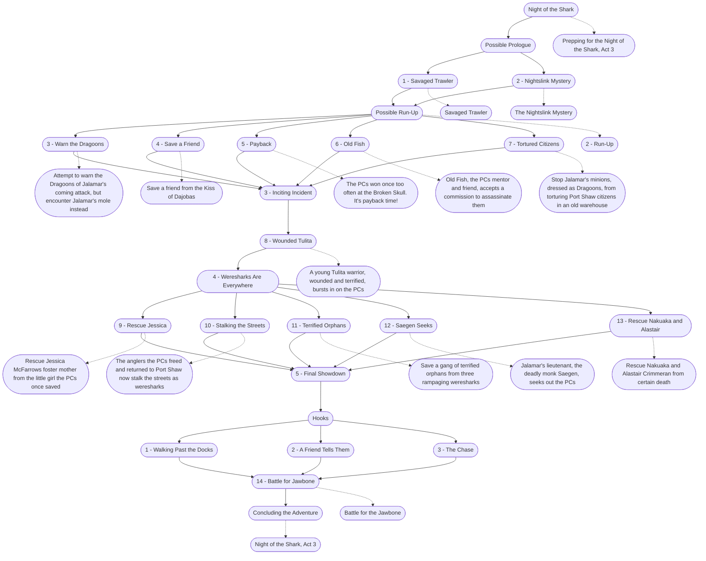

# Night of the Shark (Storyboard)
This is the general storyboard you should follow for this part of the adventure.

%%links: [ [[Rescue Jessica McFarrows foster mother from the little girl the PCs once saved]], [[Jalamar's lieutenant, the deadly monk Saegen, seeks out the PCs]], [[Savaged Trawler]], [[Save a friend from the Kiss of Dajobas]], [[Battle for the Jawbone]], [[The Nightslink Mystery]], [[Stop Jalamar's minions, dressed as Dragoons, from torturing Port Shaw citizens in an old warehouse]], [[Save a gang of terrified orphans from three rampaging weresharks]], [[The PCs won once too often at the Broken Skull. It's payback time!]], [[3 - Inciting Incident]], [[Prepping for the Night of the Shark, Act 3]], [[Old Fish, the PCs mentor and friend, accepts a commission to assassinate them]], [[A young Tulita warrior, wounded and terrified, bursts in on the PCs]], [[5 - Final Showdown]], [[Night of the Shark, Act 3]], [[The anglers the PCs freed and returned to Port Shaw now stalk the streets as weresharks]], [[Rescue Nakuaka and Alastair Crimmeran from certain death]], [[2 - Run-Up]], [[Attempt to warn the Dragoons of Jalamar's coming attack, but encounter Jalamar's mole instead]], [[4 - Weresharks Are Everywhere]] ]
