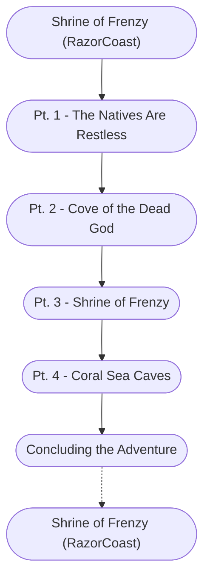

# Shrine of Frenzy (Storyboard)

%%links: [ [[Shrine of Frenzy (RazorCoast)]], [[Pt. 4 - Coral Sea Caves]], [[Pt. 3 - Shrine of Frenzy]], [[Pt. 1 - The Natives Are Restless]], [[Pt. 2 - Cove of the Dead God]] ]
