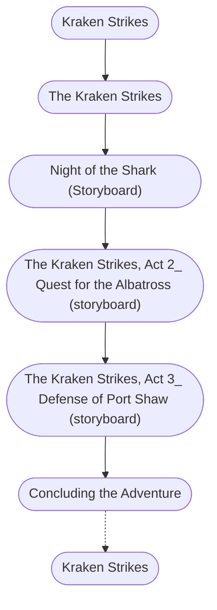

# The Kraken Strikes (Storyboard)

%%links: [ [[Kraken Strikes]], [[Night of the Shark (Storyboard)]], [[The Kraken Strikes]], [[The Kraken Strikes, Act 3_ Defense of Port Shaw (storyboard)]], [[The Kraken Strikes, Act 2_ Quest for the Albatross (storyboard)]] ]
