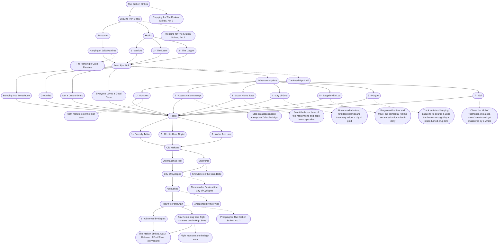

# The Kraken Strikes, Act 2: Quest for the Albatross (storyboard)
This is the general storyboard you should follow for this part of the adventure.

%%links: [ [[Bargain with a Loa and travel the elemental realms on a mission for a demi-deity]], [[Chase the Idol of Tsathogga into a sea sirene's realm and get swallowed by a whale]], [[The Pearl Eye Atoll]], [[1 - Observed by Eagles]], [[Track an island hopping plague to its source & undo the horrors wrought by a pirate-turned-drug lord]], [[Scout the home base of the Krakenfiend and hope to escape alive]], [[Stop an assassination attempt on Zalen Trafalgar]], [[Brave mad admirals, forbidden islands and treachery to loot a city of gold]], [[The Hanging of Jalia Ramires]], [[The Kraken Strikes, Act 3_ Defense of Port Shaw (storyboard)]], [[Old Makana]], [[Ambushed by the Pride]], [[Fight monsters on the high seas]], [[Old Makana's Hex]], [[Commander Perrin at the City of Cyclopes]], [[Showtime on the Sara Belle]], [[Prepping for The Kraken Strikes, Act 2]] ]
