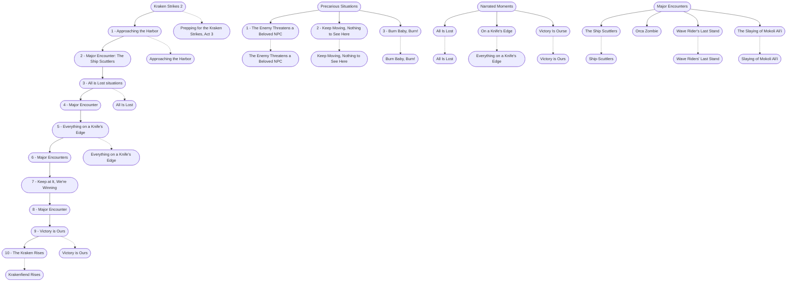

# The Kraken Strikes, Act 3: Defense of Port Shaw (storyboard)
This is the general storyboard you should follow for this part of the adventure.

%%links: [ [[The Enemy Threatens a Beloved NPC]], [[Keep Moving, Nothing to See Here]], [[Krakenfiend Rises]], [[Slaying of Mokoli Ali'i]], [[Ship-Scuttlers]], [[Approaching the Harbor]], [[Burn Baby, Burn!]], [[All Is Lost]], [[Wave Riders' Last Stand]], [[Prepping for the Kraken Strikes, Act 3]], [[Everything on a Knife's Edge]], [[Victory is Ours]], [[Orca Zombie]] ]
