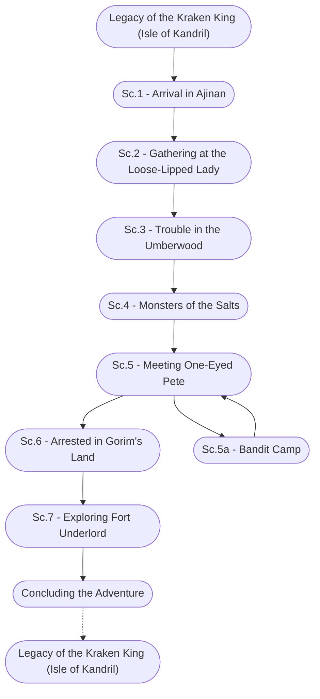

# Legacy of the Kraken King

%%links: [ [[Legacy of the Kraken King (Isle of Kandril)]], [[Sc.3 - Trouble in the Umberwood]], [[Sc.5 - Meeting One-Eyed Pete]], [[Sc.1 - Arrival in Ajinan]], [[Sc.7 - Exploring Fort Underlord]], [[Sc.4 - Monsters of the Salts]], [[Sc.5a - Bandit Camp]], [[Sc.2 - Gathering at the Loose-Lipped Lady]], [[Sc.6 - Arrested in Gorim's Land]] ]
