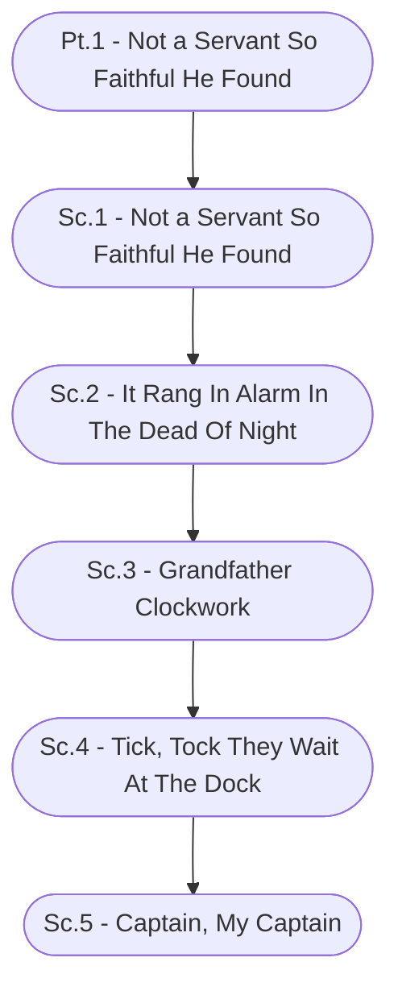

# Ch. 1, Pt. 1: Not a Servant So Faithful He Found Storyboard

%%links: [ [[Sc.3 - Grandfather Clockwork]], [[Sc.4 - Tick, Tock They Wait At The Dock]], [[Sc.2 - It Rang In Alarm In The Dead Of Night]], [[Sc.5 - Captain, My Captain]], [[Sc.1 - Not a Servant So Faithful He Found]], [[Pt.1 - Not a Servant So Faithful He Found]] ]
