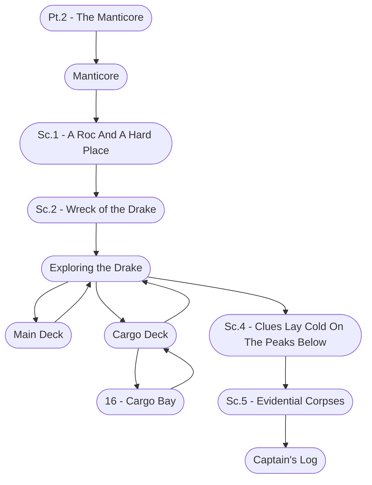

# Ch. 1, Pt. 2: The Manticore Storyboard

%%links: [ [[Sc.5 - Evidential Corpses]], [[16 - Cargo Bay]], [[Pt.2 - The Manticore]], [[Cargo Deck]], [[Sc.1 - A Roc And A Hard Place]], [[Sc.4 - Clues Lay Cold On The Peaks Below]], [[Captain's Log]], [[Manticore]], [[Sc.2 - Wreck of the Drake]], [[Main Deck]] ]
