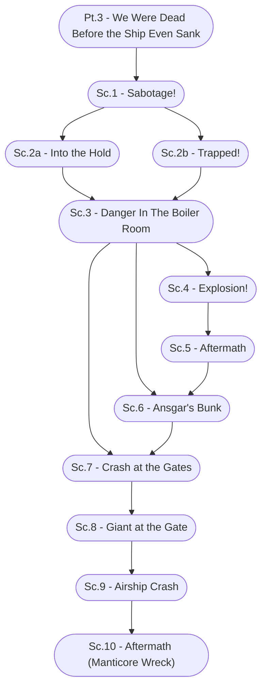

# Ch. 1, Pt. 3: We Were Dead Before the Ship Even Sank Storyboard

%%links: [ [[Sc.3 - Danger In The Boiler Room]], [[Sc.1 - Sabotage!]], [[Pt.3 - We Were Dead Before the Ship Even Sank]], [[Sc.4 - Explosion!]], [[Sc.6 - Ansgar's Bunk]], [[Sc.2a - Into the Hold]], [[Sc.8 - Giant at the Gate]], [[Sc.10 - Aftermath (Manticore Wreck)]], [[Sc.7 - Crash at the Gates]], [[Sc.9 - Airship Crash]], [[Sc.2b - Trapped!]], [[Sc.5 - Aftermath]] ]
