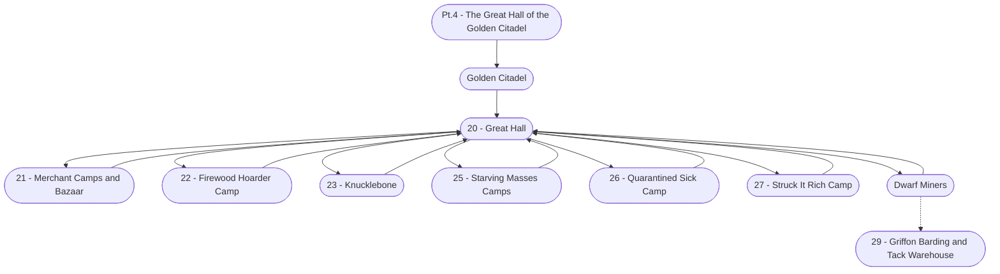

# Ch. 1, Pt. 4: The Great Hall of the Golden Citadel Storyboard

%%links: [ [[23 - Knucklebone]], [[20 - Great Hall]], [[27 - Struck It Rich Camp]], [[21 - Merchant Camps and Bazaar]], [[Pt.4 - The Great Hall of the Golden Citadel]], [[25 - Starving Masses Camps]], [[26 - Quarantined Sick Camp]], [[Golden Citadel]], [[29 - Griffon Barding and Tack Warehouse]], [[22 - Firewood Hoarder Camp]] ]
