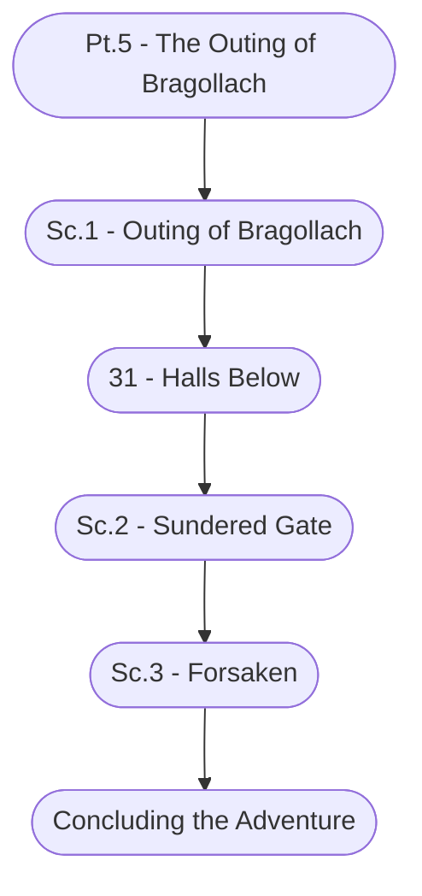

# Ch. 1, Pt. 5: The Outing of Bragollach Storyboard

%%links: [ [[Pt.5 - The Outing of Bragollach]], [[Sc.3 - Forsaken]], [[Sc.2 - Sundered Gate]], [[Sc.1 - Outing of Bragollach]], [[31 - Halls Below]] ]
