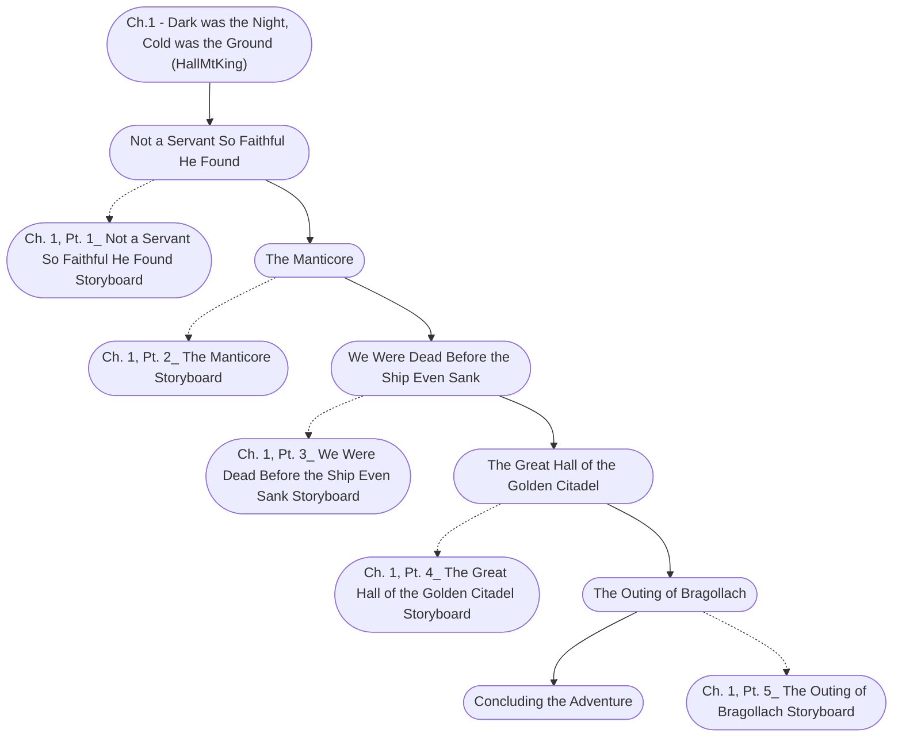

# Ch. 1: Dark was the Night, Cold was the Ground Storyboard

%%links: [ [[Ch. 1, Pt. 5_ The Outing of Bragollach Storyboard]], [[Ch. 1, Pt. 4_ The Great Hall of the Golden Citadel Storyboard]], [[Ch. 1, Pt. 3_ We Were Dead Before the Ship Even Sank Storyboard]], [[Ch.1 - Dark was the Night, Cold was the Ground (HallMtKing)]], [[Ch. 1, Pt. 2_ The Manticore Storyboard]], [[Ch. 1, Pt. 1_ Not a Servant So Faithful He Found Storyboard]] ]
