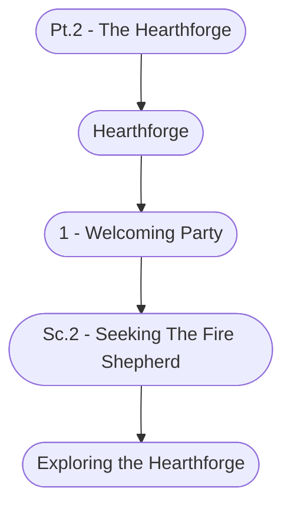

# Ch. 2, Pt. 2: The Hearthforge Storyboard

```mermaid
flowchart TD
Node_1(["Pt.2 - The Hearthforge"]); class Node_1 internal-link
Node_2(["Hearthforge"]); class Node_2 internal-link
Node_3(["1 - Welcoming Party"]); class Node_3 internal-link
Node_4(["Exploring the Hearthforge"])
Node_5(["Sc.2 - Seeking The Fire Shepherd"]); class Node_5 internal-link
Node_1 --> Node_2
Node_2 --> Node_3
Node_3 --> Node_5
Node_5 --> Node_4
```
%%links: [ [[Sc.2 - Seeking The Fire Shepherd]], [[Hearthforge]], [[1 - Welcoming Party]], [[Pt.2 - The Hearthforge]] ]
