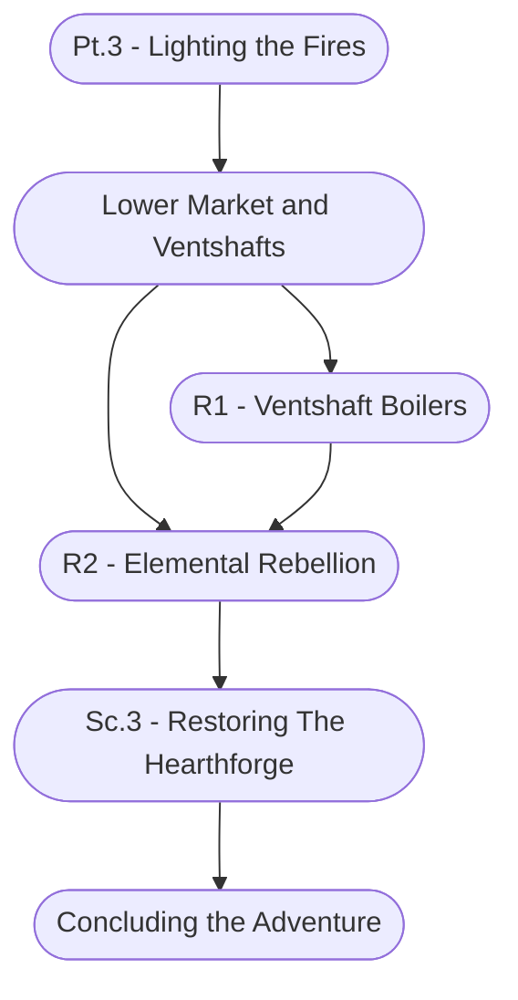

# Ch. 2, Pt. 3: Lighting the Fires Storyboard

%%links: [ [[R2 - Elemental Rebellion]], [[Sc.3 - Restoring The Hearthforge]], [[Pt.3 - Lighting the Fires]], [[Lower Market and Ventshafts]], [[R1 - Ventshaft Boilers]] ]
