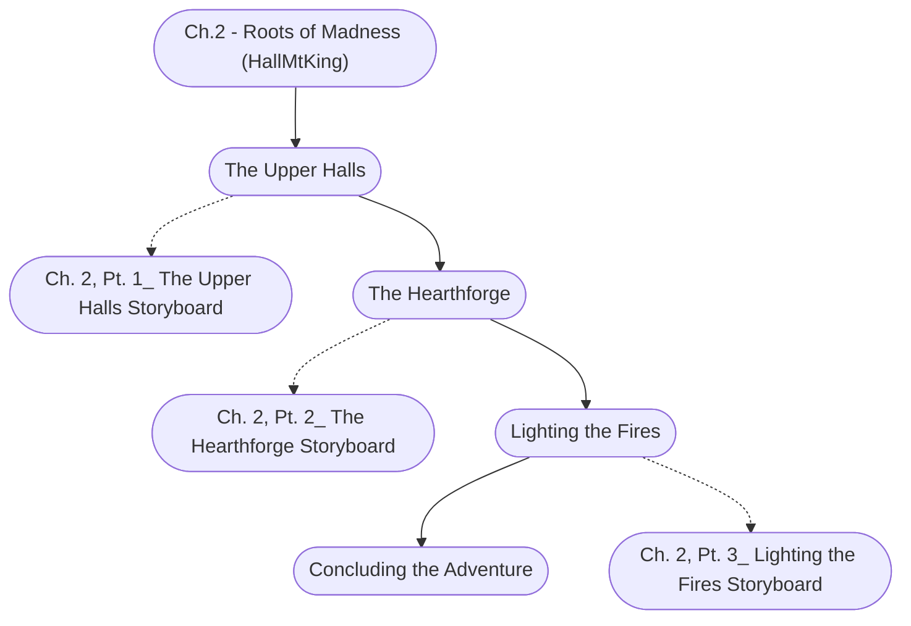

# Ch. 2: Roots of Madness Storyboard

%%links: [ [[Ch. 2, Pt. 3_ Lighting the Fires Storyboard]], [[Ch. 2, Pt. 1_ The Upper Halls Storyboard]], [[Ch. 2, Pt. 2_ The Hearthforge Storyboard]], [[Ch.2 - Roots of Madness (HallMtKing)]] ]
