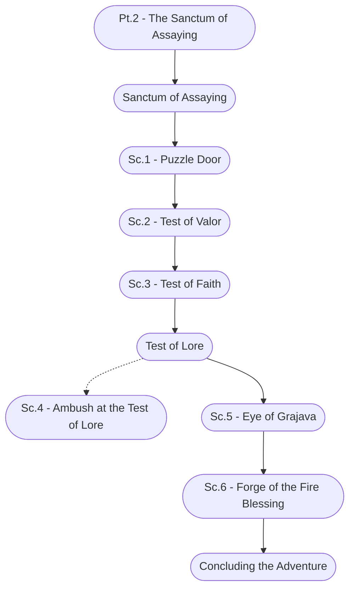

# Ch. 3, Pt. 2: The Sanctum of Assaying Storyboard

%%links: [ [[Sc.1 - Puzzle Door]], [[Sc.2 - Test of Valor]], [[Sanctum of Assaying]], [[Sc.3 - Test of Faith]], [[Sc.5 - Eye of Grajava]], [[Sc.6 - Forge of the Fire Blessing]], [[Pt.2 - The Sanctum of Assaying]], [[Sc.4 - Ambush at the Test of Lore]] ]
