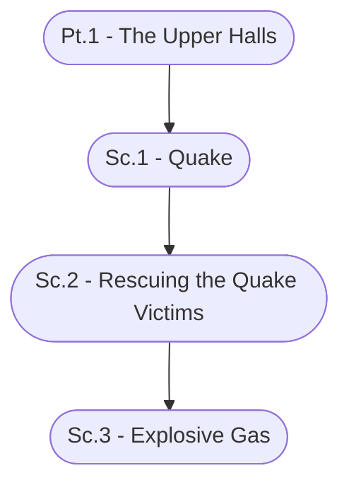

# Ch. 4, Pt. 1: The Upper Halls Storyboard

```mermaid
flowchart TD
Node_1(["Pt.1 - The Upper Halls"]); class Node_1 internal-link
Node_2(["Sc.1 - Quake"]); class Node_2 internal-link
Node_3(["Sc.2 - Rescuing the Quake Victims"]); class Node_3 internal-link
Node_4(["Sc.3 - Explosive Gas"]); class Node_4 internal-link
Node_1 --> Node_2
Node_2 --> Node_3
Node_3 --> Node_4
```
%%links: [ [[Sc.3 - Explosive Gas]], [[Sc.2 - Rescuing the Quake Victims]], [[Pt.1 - The Upper Halls]], [[Sc.1 - Quake]] ]
