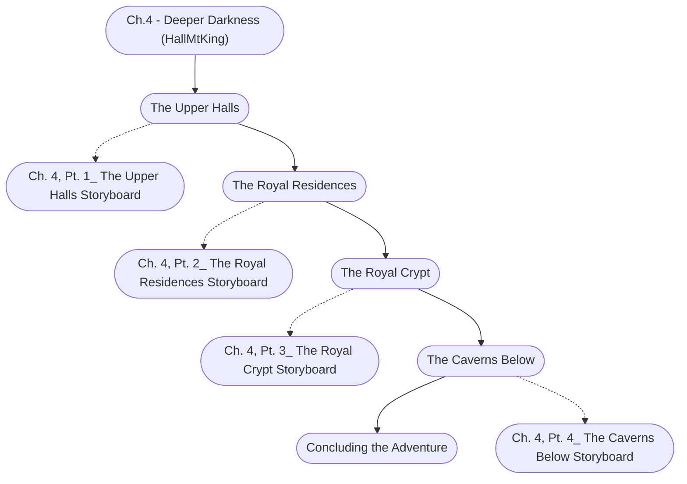

# Ch. 4: Deeper Darkness Storyboard

%%links: [ [[Ch. 4, Pt. 2_ The Royal Residences Storyboard]], [[Ch. 4, Pt. 1_ The Upper Halls Storyboard]], [[Ch. 4, Pt. 4_ The Caverns Below Storyboard]], [[Ch.4 - Deeper Darkness (HallMtKing)]], [[Ch. 4, Pt. 3_ The Royal Crypt Storyboard]] ]
