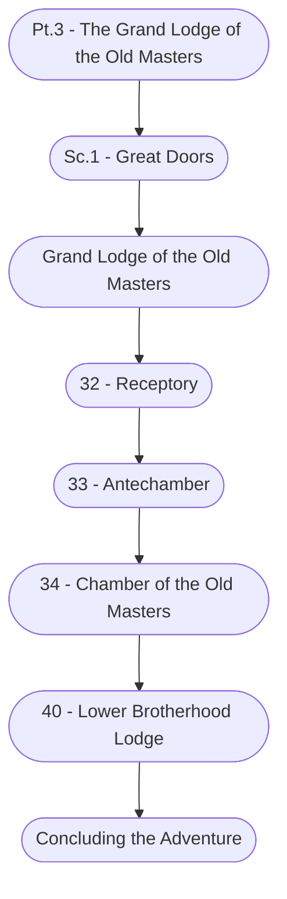

# Ch. 5, Pt. 3: The Grand Lodge of the Old Masters Storyboard

%%links: [ [[40 - Lower Brotherhood Lodge]], [[Grand Lodge of the Old Masters]], [[32 - Receptory]], [[33 - Antechamber]], [[Sc.1 - Great Doors]], [[Pt.3 - The Grand Lodge of the Old Masters]], [[34 - Chamber of the Old Masters]] ]
