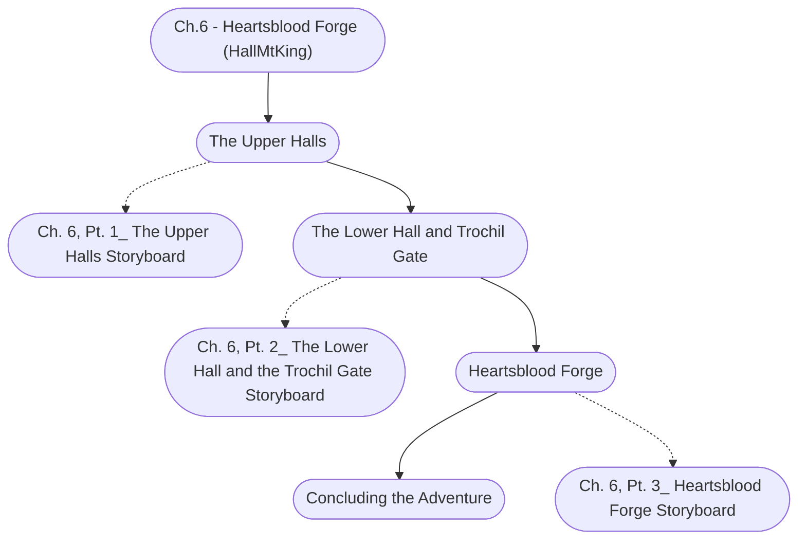

# Ch. 6: Heartsblood Forge Storyboard

%%links: [ [[Ch.6 - Heartsblood Forge (HallMtKing)]], [[Ch. 6, Pt. 2_ The Lower Hall and the Trochil Gate Storyboard]], [[Ch. 6, Pt. 1_ The Upper Halls Storyboard]], [[Ch. 6, Pt. 3_ Heartsblood Forge Storyboard]] ]
