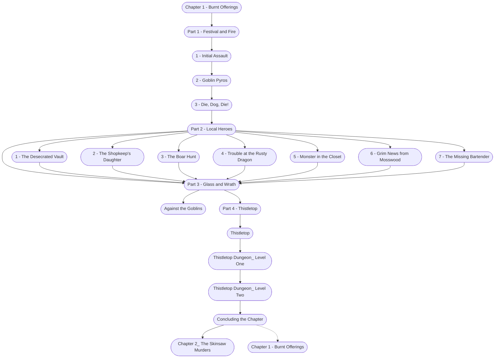

# Chapter 1: Burnt Offerings

%%links: [ [[Thistletop Dungeon_ Level One]], [[Thistletop Dungeon_ Level Two]], [[4 - Trouble at the Rusty Dragon]], [[Part 3 - Glass and Wrath]], [[Chapter 1 - Burnt Offerings]], [[5 - Monster in the Closet]], [[Part 2 - Local Heroes]], [[Chapter 2_ The Skinsaw Murders]], [[Part 4 - Thistletop]], [[1 - Initial Assault]], [[2 - Goblin Pyros]], [[2 - The Shopkeep's Daughter]], [[3 - The Boar Hunt]], [[7 - The Missing Bartender]], [[1 - The Desecrated Vault]], [[Part 1 - Festival and Fire]], [[Against the Goblins]], [[6 - Grim News from Mosswood]], [[Thistletop]], [[3 - Die, Dog, Die!]] ]
