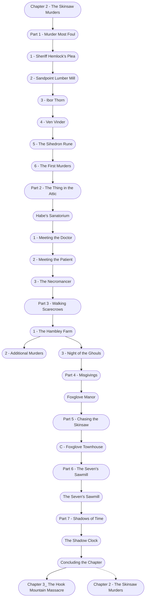

# Chapter 2: The Skinsaw Murders

%%links: [ [[Foxglove Manor]], [[5 - The Sihedron Rune]], [[Chapter 2 - The Skinsaw Murders]], [[2 - Meeting the Patient]], [[Part 5 - Chasing the Skinsaw]], [[1 - The Hambley Farm]], [[3 - Ibor Thorn]], [[4 - Ven Vinder]], [[2 - Sandpoint Lumber Mill]], [[Part 4 - Misgivings]], [[1 - Sheriff Hemlock's Plea]], [[2 - Additional Murders]], [[Habe's Sanatorium]], [[6 - The First Murders]], [[Part 6 - The Seven's Sawmill]], [[Part 3 - Walking Scarecrows]], [[Part 7 - Shadows of Time]], [[The Shadow Clock]], [[1 - Meeting the Doctor]], [[3 - The Necromancer]], [[Part 1 - Murder Most Foul]], [[C - Foxglove Townhouse]], [[Part 2 - The Thing in the Attic]], [[The Seven's Sawmill]], [[Chapter 3_ The Hook Mountain Massacre]], [[3 - Night of the Ghouls]] ]
