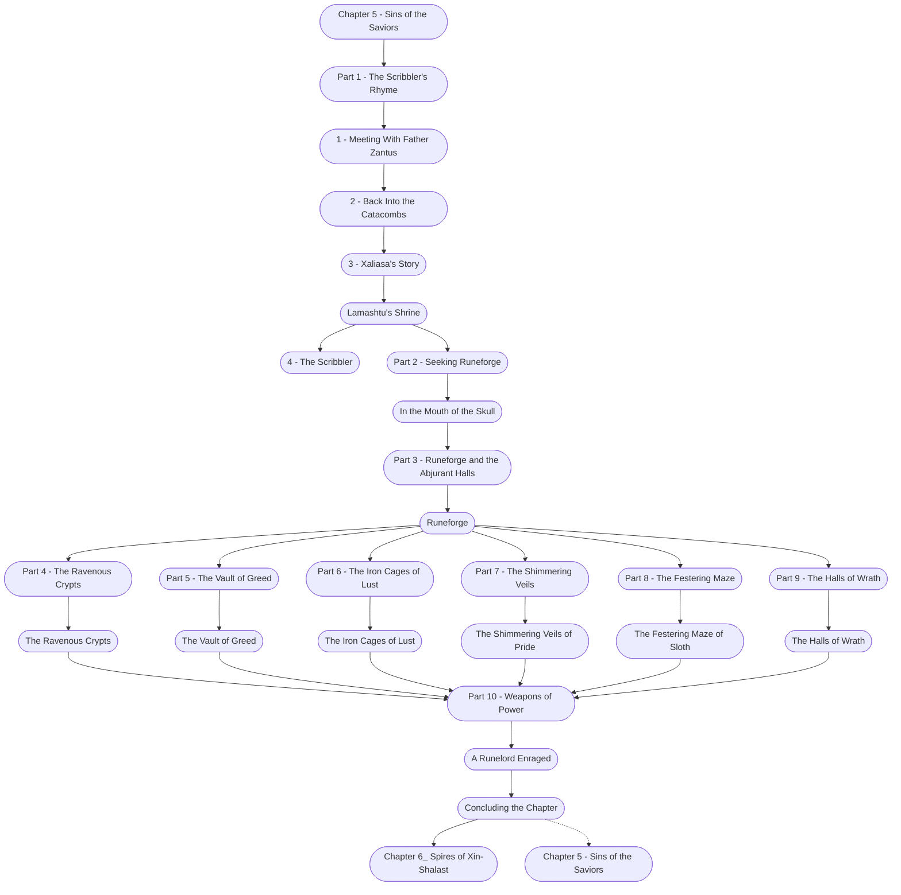

# Chapter 5: Sins of the Saviors

%%links: [ [[The Festering Maze of Sloth]], [[Runeforge]], [[Chapter 6_ Spires of Xin-Shalast]], [[4 - The Scribbler]], [[Part 9 - The Halls of Wrath]], [[Part 5 - The Vault of Greed]], [[Part 7 - The Shimmering Veils]], [[The Iron Cages of Lust]], [[Lamashtu's Shrine]], [[Part 8 - The Festering Maze]], [[Part 10 - Weapons of Power]], [[The Vault of Greed]], [[Chapter 5 - Sins of the Saviors]], [[1 - Meeting With Father Zantus]], [[Part 2 - Seeking Runeforge]], [[2 - Back Into the Catacombs]], [[Part 3 - Runeforge and the Abjurant Halls]], [[The Shimmering Veils of Pride]], [[Part 1 - The Scribbler's Rhyme]], [[Part 6 - The Iron Cages of Lust]], [[The Halls of Wrath]], [[A Runelord Enraged]], [[In the Mouth of the Skull]], [[Part 4 - The Ravenous Crypts]], [[The Ravenous Crypts]], [[3 - Xaliasa's Story]] ]
