# Chapter 6: Spires of Xin-Shalast

```mermaid
flowchart TD
Node_1a(["Rise of the Runelords"]); class Node_1a internal-link
Node_1(["Concluding the Adventure"])
Node_2(["Chapter 6 - Spires of Xin-Shalast"]); class Node_2 internal-link
Node_3(["Part 1 - Seeking Xin-Shalast"]); class Node_3 internal-link
Node_4(["Part 2 - Whispers in the Wind"]); class Node_4 internal-link
Node_5(["Vekkers' Cabin"]); class Node_5 internal-link
Node_6(["Event 1_ Cannibal Fury"]); class Node_6 internal-link
Node_7(["Event 2_ A Ghost's Plea"]); class Node_7 internal-link
Node_8(["Event 3_ Hungry Ghost"]); class Node_8 internal-link
Node_9(["Event 4_ The Wendigo Siege"]); class Node_9 internal-link
Node_10(["Part 3 - On the World's Roof"]); class Node_10 internal-link
Node_11(["C - Queen of the Icemists"]); class Node_11 internal-link
Node_12(["D - Giant Sentinels"]); class Node_12 internal-link
Node_13(["Part 4 - Xin-Shalast"]); class Node_13 internal-link
Node_14(["Event 5_ Emergence of the Spared"]); class Node_14 internal-link
Node_15(["Xin-Shalast_ Lower City"]); class Node_15 internal-link
Node_16(["Part 5 - Scaling Mhar Massif"]); class Node_16 internal-link
Node_17(["1 - Invaders from Leng"]); class Node_17 internal-link
Node_18(["2 - The Occluding Field"]); class Node_18 internal-link
Node_19(["Part 6 - Pinnacle of Avarice"]); class Node_19 internal-link
Node_20(["The Pinnacle of Avarice"]); class Node_20 internal-link
Node_21(["Part 7 - The Eye of Avarice"]); class Node_21 internal-link
Node_22(["The Eye of Avarice"]); class Node_22 internal-link
Node_23(["The Final Battle"]); class Node_23 internal-link
Node_1 -.-> Node_1a
Node_2 --> Node_3
Node_3 --> Node_4
Node_4 --> Node_5
Node_5 --> Node_6
Node_6 --> Node_7
Node_7 --> Node_8
Node_8 --> Node_9
Node_9 --> Node_10
Node_10 --> Node_11
Node_11 --> Node_12
Node_12 --> Node_13
Node_13 --> Node_15
Node_14 --> Node_16
Node_15 --> Node_14
Node_16 --> Node_17
Node_17 --> Node_18
Node_18 --> Node_19
Node_19 --> Node_20
Node_20 --> Node_21
Node_21 --> Node_22
Node_22 --> Node_23
Node_23 --> Node_1
```

%%links: [ [[Event 3_ Hungry Ghost]], [[Part 6 - Pinnacle of Avarice]], [[The Pinnacle of Avarice]], [[The Eye of Avarice]], [[1 - Invaders from Leng]], [[Part 1 - Seeking Xin-Shalast]], [[Part 2 - Whispers in the Wind]], [[Rise of the Runelords]], [[2 - The Occluding Field]], [[Part 7 - The Eye of Avarice]], [[Part 3 - On the World's Roof]], [[Chapter 6 - Spires of Xin-Shalast]], [[Part 5 - Scaling Mhar Massif]], [[Part 4 - Xin-Shalast]], [[Event 5_ Emergence of the Spared]], [[The Final Battle]], [[D - Giant Sentinels]], [[Event 4_ The Wendigo Siege]], [[Xin-Shalast_ Lower City]], [[Vekkers' Cabin]], [[C - Queen of the Icemists]], [[Event 2_ A Ghost's Plea]], [[Event 1_ Cannibal Fury]] ]
