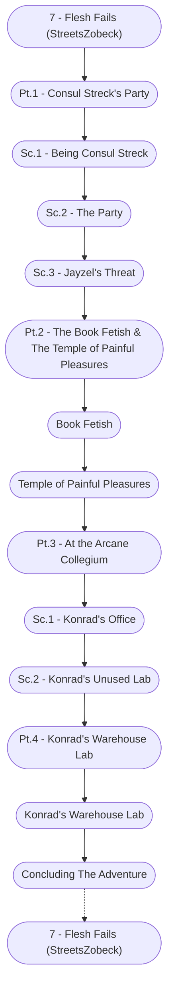

# Flesh Fails Storyboard

%%links: [ [[Sc.2 - Konrad's Unused Lab]], [[Pt.1 - Consul Streck's Party]], [[Sc.2 - The Party]], [[Sc.3 - Jayzel's Threat]], [[Temple of Painful Pleasures]], [[Pt.2 - The Book Fetish & The Temple of Painful Pleasures]], [[7 - Flesh Fails (StreetsZobeck)]], [[Sc.1 - Being Consul Streck]], [[Konrad's Warehouse Lab]], [[Book Fetish]], [[Pt.4 - Konrad's Warehouse Lab]], [[Pt.3 - At the Arcane Collegium]], [[Sc.1 - Konrad's Office]] ]
