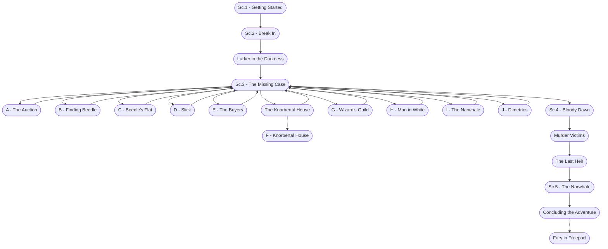

# Fury in Freeport Storyboard

%%links: [ [[Sc.1 - Getting Started]], [[H - Man in White]], [[J - Dimetrios]], [[Murder Victims]], [[I - The Narwhale]], [[Sc.4 - Bloody Dawn]], [[E - The Buyers]], [[Lurker in the Darkness]], [[C - Beedle's Flat]], [[Fury in Freeport]], [[Sc.3 - The Missing Case]], [[D - Slick]], [[A - The Auction]], [[B - Finding Beedle]], [[The Last Heir]], [[F - Knorbertal House]], [[Sc.5 - The Narwhale]], [[Sc.2 - Break In]], [[G - Wizard's Guild]] ]
