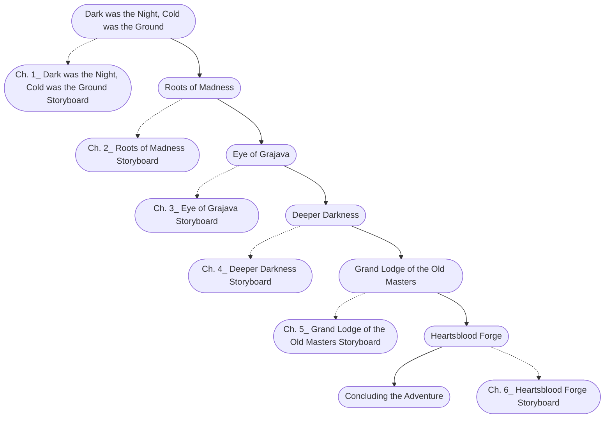

# Halls of the Mountain-King Storyboard

%%links: [ [[Ch. 6_ Heartsblood Forge Storyboard]], [[Ch. 5_ Grand Lodge of the Old Masters Storyboard]], [[Ch. 2_ Roots of Madness Storyboard]], [[Ch. 3_ Eye of Grajava Storyboard]], [[Ch. 1_ Dark was the Night, Cold was the Ground Storyboard]], [[Ch. 4_ Deeper Darkness Storyboard]] ]
