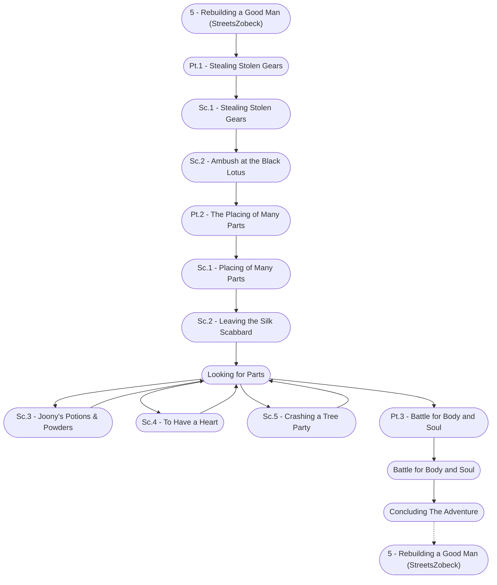

# Rebuilding a Good Man Storyboard

%%links: [ [[Sc.3 - Joony's Potions & Powders]], [[Battle for Body and Soul]], [[Sc.1 - Placing of Many Parts]], [[Sc.2 - Ambush at the Black Lotus]], [[Sc.2 - Leaving the Silk Scabbard]], [[Pt.2 - The Placing of Many Parts]], [[Pt.3 - Battle for Body and Soul]], [[Sc.5 - Crashing a Tree Party]], [[Pt.1 - Stealing Stolen Gears]], [[Sc.4 - To Have a Heart]], [[Sc.1 - Stealing Stolen Gears]], [[5 - Rebuilding a Good Man (StreetsZobeck)]] ]
