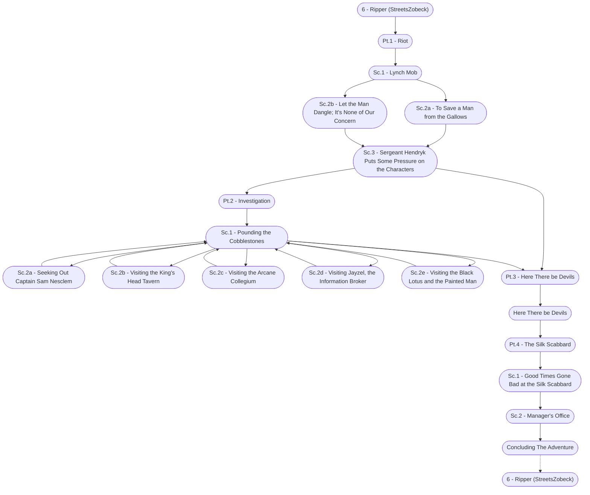

# Ripper Storyboard

%%links: [ [[Sc.2b - Let the Man Dangle; It's None of Our Concern]], [[Sc.2a - Seeking Out Captain Sam Nesclem]], [[Pt.3 - Here There be Devils]], [[6 - Ripper (StreetsZobeck)]], [[Sc.2a - To Save a Man from the Gallows]], [[Pt.1 - Riot]], [[Sc.2c - Visiting the Arcane Collegium]], [[Pt.4 - The Silk Scabbard]], [[Sc.2b - Visiting the King's Head Tavern]], [[Pt.2 - Investigation]], [[Sc.3 - Sergeant Hendryk Puts Some Pressure on the Characters]], [[Sc.2 - Manager's Office]], [[Sc.2d - Visiting Jayzel, the Information Broker]], [[Here There be Devils]], [[Sc.1 - Pounding the Cobblestones]], [[Sc.1 - Good Times Gone Bad at the Silk Scabbard]], [[Sc.2e - Visiting the Black Lotus and the Painted Man]], [[Sc.1 - Lynch Mob]] ]
