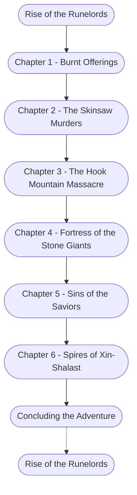

# Rise of the Runelords

%%links: [ [[Chapter 1 - Burnt Offerings]], [[Chapter 2 - The Skinsaw Murders]], [[Chapter 4 - Fortress of the Stone Giants]], [[Chapter 5 - Sins of the Saviors]], [[Rise of the Runelords]], [[Chapter 6 - Spires of Xin-Shalast]], [[Chapter 3 - The Hook Mountain Massacre]] ]
