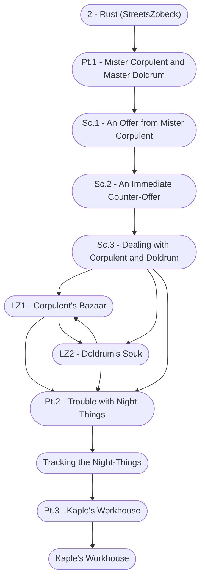

# Rust Storyboard

%%links: [ [[Sc.2 - An Immediate Counter-Offer]], [[Pt.1 - Mister Corpulent and Master Doldrum]], [[Sc.1 - An Offer from Mister Corpulent]], [[Kaple's Workhouse]], [[2 - Rust (StreetsZobeck)]], [[Pt.3 - Kaple's Workhouse]], [[LZ2 - Doldrum's Souk]], [[Pt.2 - Trouble with Night-Things]], [[Sc.3 - Dealing with Corpulent and Doldrum]], [[Tracking the Night-Things]], [[LZ1 - Corpulent's Bazaar]] ]
