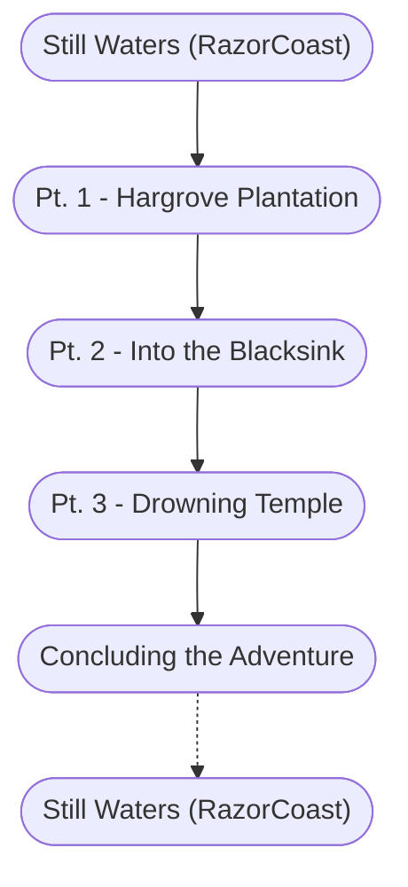

# Still Waters (Storyboard)

```mermaid
flowchart TD
Node_1(["Still Waters (RazorCoast)"]); class Node_1 internal-link
Node_2(["Pt. 1 - Hargrove Plantation"]); class Node_2 internal-link
Node_3(["Pt. 2 - Into the Blacksink"]); class Node_3 internal-link
Node_4(["Pt. 3 - Drowning Temple"]); class Node_4 internal-link
Node_5a(["Still Waters (RazorCoast)"]); class Node_5a internal-link
Node_5(["Concluding the Adventure"])
Node_1 --> Node_2
Node_2 --> Node_3
Node_3 --> Node_4
Node_4 --> Node_5
Node_5 -.-> Node_5a
```
%%links: [ [[Pt. 2 - Into the Blacksink]], [[Still Waters (RazorCoast)]], [[Pt. 3 - Drowning Temple]], [[Pt. 1 - Hargrove Plantation]] ]
