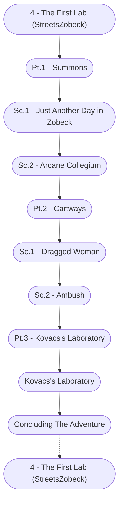

# The First Lab Storyboard

%%links: [ [[Sc.2 - Arcane Collegium]], [[Pt.3 - Kovacs's Laboratory]], [[Pt.2 - Cartways]], [[Sc.2 - Ambush]], [[Pt.1 - Summons]], [[Sc.1 - Just Another Day in Zobeck]], [[Sc.1 - Dragged Woman]], [[Kovacs's Laboratory]], [[4 - The First Lab (StreetsZobeck)]] ]
