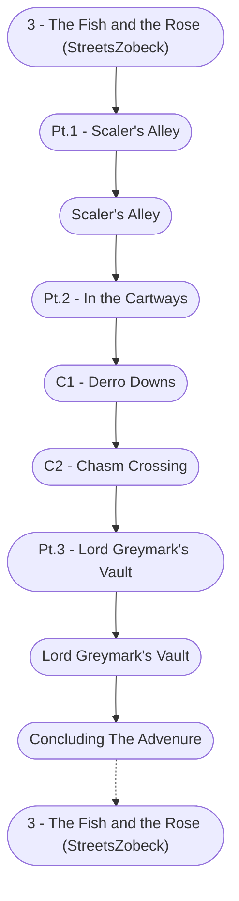

# The Fish and the Rose Storyboard

%%links: [ [[Scaler's Alley]], [[Pt.3 - Lord Greymark's Vault]], [[C2 - Chasm Crossing]], [[Pt.1 - Scaler's Alley]], [[3 - The Fish and the Rose (StreetsZobeck)]], [[C1 - Derro Downs]], [[Pt.2 - In the Cartways]], [[Lord Greymark's Vault]] ]
