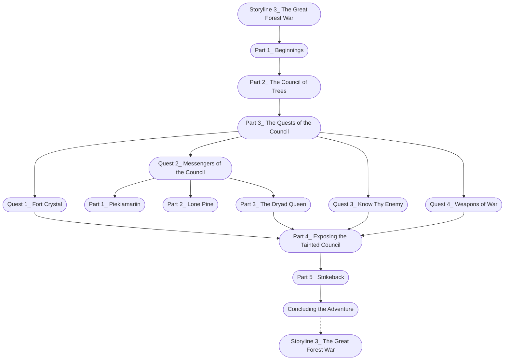

# The Great Forest War

%%links: [ [[Quest 4_ Weapons of War]], [[Part 2_ Lone Pine]], [[Quest 2_ Messengers of the Council]], [[Part 3_ The Dryad Queen]], [[Part 3_ The Quests of the Council]], [[Part 2_ The Council of Trees]], [[Part 1_ Beginnings]], [[Part 1_ Piekiamariin]], [[Quest 1_ Fort Crystal]], [[Quest 3_ Know Thy Enemy]], [[Part 5_ Strikeback]], [[Storyline 3_ The Great Forest War]], [[Part 4_ Exposing the Tainted Council]] ]
