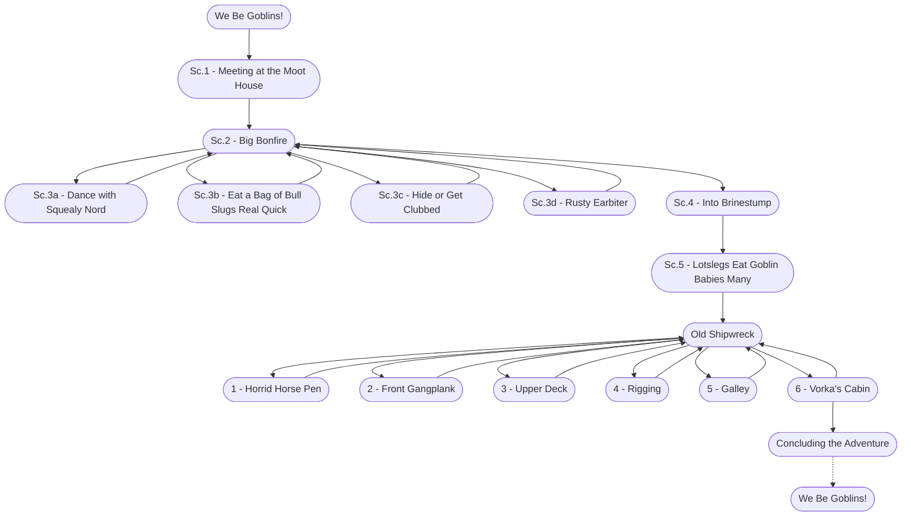

# We Be Goblins! Storyboard

%%links: [ [[1 - Horrid Horse Pen]], [[2 - Front Gangplank]], [[Sc.2 - Big Bonfire]], [[Sc.3d - Rusty Earbiter]], [[Sc.4 - Into Brinestump]], [[Old Shipwreck]], [[Sc.3b - Eat a Bag of Bull Slugs Real Quick]], [[Sc.3c - Hide or Get Clubbed]], [[Sc.1 - Meeting at the Moot House]], [[Sc.5 - Lotslegs Eat Goblin Babies Many]], [[6 - Vorka's Cabin]], [[We Be Goblins!]], [[Sc.3a - Dance with Squealy Nord]], [[3 - Upper Deck]], [[4 - Rigging]], [[5 - Galley]] ]
