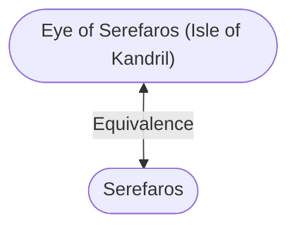

# Eye of Serefaros (Isle of Kandril)
## Overview
---
## Connections

```mermaid
flowchart TD
Topic_4016(["Eye of Serefaros (Isle of Kandril)"]); class Topic_4016 internal-link
Topic_3946(["Serefaros"]); class Topic_3946 internal-link
Topic_4016-- "Equivalence" <-->Topic_3946
```
%%
links: [ [[ Serefaros]] ]
%%

---
## Tags
#Setting-Scope/Isle-of-Kandril

